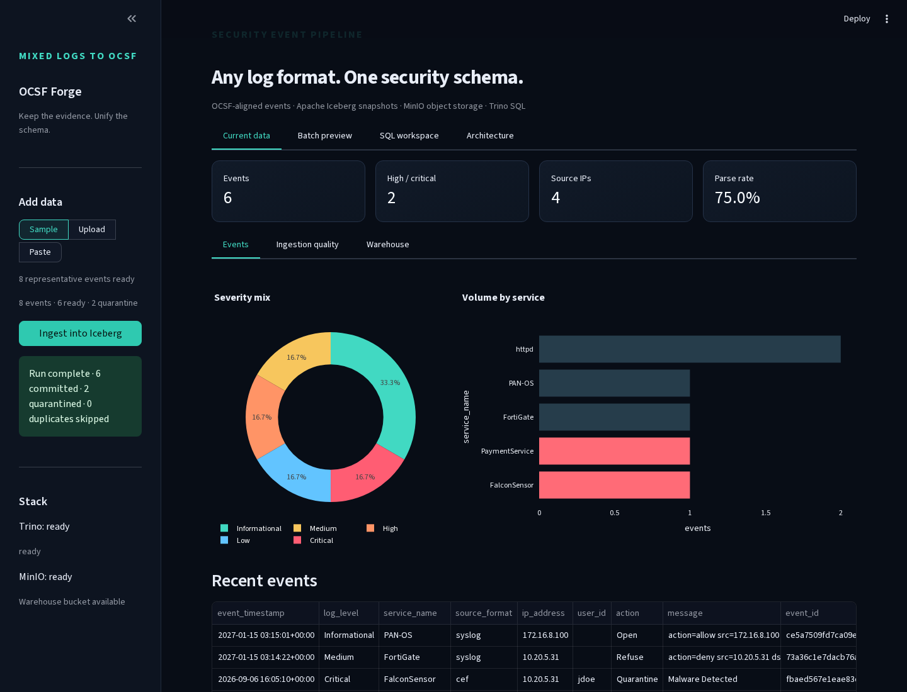
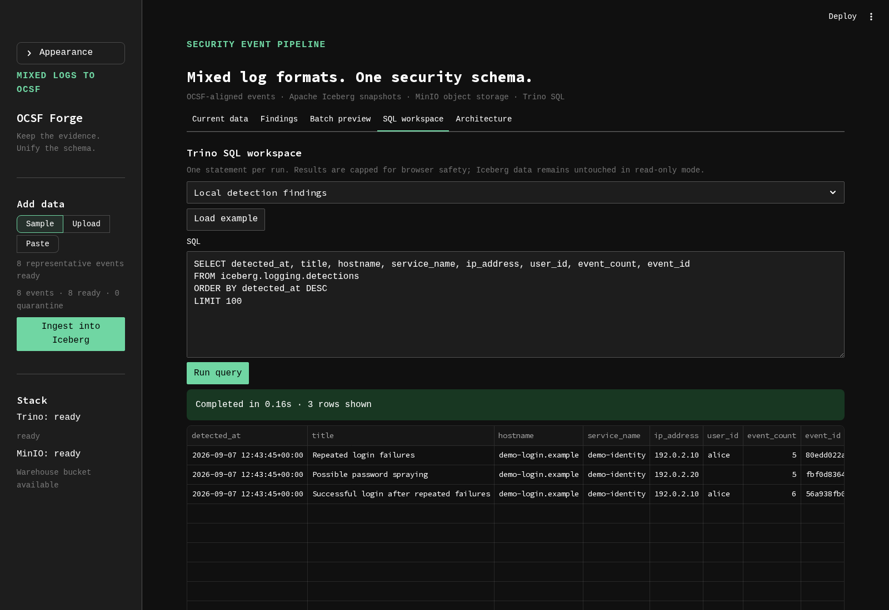
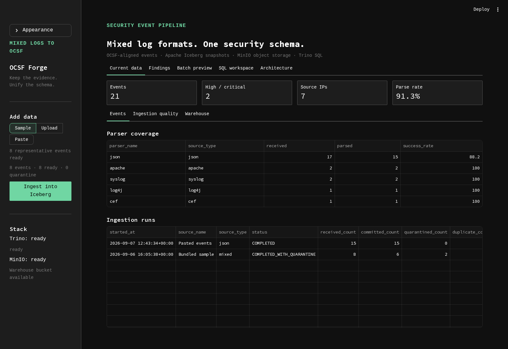
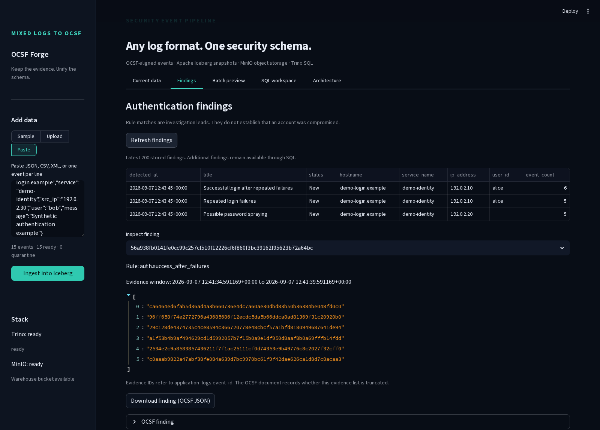

# OCSF Forge

[](https://github.com/krishang0224/ocsf-forge/actions/workflows/ci.yml)
[](LICENSE)
[](CONTRIBUTING.md)

**Mixed logs in. Queryable OCSF out.**

OCSF Forge turns JSON, CSV, XML, CEF, LEEF, Syslog, Apache, and Log4j records into one security-event model. It keeps the original evidence, sends bad records to quarantine, and writes the clean stream to Apache Iceberg for SQL analysis through Trino.

An optional detection worker identifies repeated authentication failures, possible password spraying, and successful logons after repeated failures. Findings include the triggering rule and source event IDs for investigation.

The project exists for a familiar reason: collecting logs is easy; making eight incompatible formats useful in the same query is not.



Screenshots use the bundled synthetic sample logs. [Why OCSF?](docs/why-ocsf.md)

<details>
<summary>SQL workspace and ingestion results</summary>





</details>

## See the pipeline work

```text
files / paste / Kafka
        |
        v
JSON / CSV / XML / CEF / LEEF / Syslog / Apache / Log4j
        |
        v
versioned parser registry
        |
        +-- raw_events          original evidence
        +-- quarantine_events   rejected data + reason
        +-- application_logs    normalized OCSF 1.8 events
                    +-- authentication rules --> detections
                    |
                    v
             Trino SQL + dashboard

Iceberg catalog  -> Lakekeeper + PostgreSQL
Parquet storage  -> MinIO
```

Every record gets a deterministic ID from its source, offset, and payload hash. Replaying a file or Kafka range fills incomplete writes without duplicating rows.

## Run locally

You need Docker Compose or Podman Compose. The first launch downloads several images and builds the app; allow extra time for your connection and laptop. Later launches reuse cached images. The local Trino configuration reserves a 4 GB Java heap, in addition to the other services.

```bash
cp .env.example .env
docker compose up --build -d
```

Open [localhost:8501](http://localhost:8501), choose Sample, Upload, or Paste, and commit the batch. The dashboard shows parser quality, quarantine counts, ingestion runs, and Iceberg file health.

Useful local endpoints:

| Service | URL |
| --- | --- |
| OCSF Forge | <http://localhost:8501> |
| Trino | <http://localhost:8080> |
| MinIO console | <http://localhost:9001> |
| Lakekeeper API | <http://localhost:8181> |

All ports bind to loopback. Named volumes keep the warehouse, catalog, and Kafka state when containers are recreated. `docker compose down --volumes` deletes that state permanently.

## What is already handled

- CEF extension values containing spaces and escaped delimiters
- Apache Common and Combined formats
- RFC 3164 and RFC 5424 Syslog
- multiline Log4j stack traces in files, pasted input, or one complete Kafka message
- JSON arrays, CSV files, and XML event collections
- timezone-aware timestamps with microsecond precision
- invalid timestamps, IP addresses, and ports routed to quarantine
- OCSF 1.8 class, category, activity, type, severity, and status IDs
- concurrent Iceberg commit conflicts with bounded retry
- duplicate-safe replay after a timeout or partial write
- separate Trino permissions for ingestion, dashboards, and analysts

Adding a parser does not require changing the pipeline or UI. See [parser development](docs/parser-development.md).

## Measured, not guessed

These numbers came from the local Compose stack on a 16 GB development machine. They are a regression baseline, not a throughput promise for other hardware.

| Check | Result |
| --- | ---: |
| Mixed-format parser run | 50,000 records at ~11,900 records/sec |
| Durable 2,500-row ingest | 14.2 seconds (~177 records/sec) |
| Four concurrent writers | 2,000/2,000 rows committed, 2,000 unique IDs |
| Kafka end-to-end | 5,000/5,000 raw records received |
| Invalid Kafka records | 250/250 quarantined and sent to the dead-letter topic |
| Replay test | 2,500 duplicates detected, zero duplicate rows added |
| Automated checks | [Latest CI result and test output](https://github.com/krishang0224/ocsf-forge/actions/workflows/ci.yml) |

The first load test exposed real Iceberg conflicts and Trino's 1 MB query-text ceiling. The current writer retries idempotent commits and splits batches by both row count and encoded parameter size.

CI runs lint, tests, and Compose configuration validation on pushes and pull requests. It does not reproduce the live throughput benchmarks above.

## Stream from Kafka

```bash
docker compose --profile streaming up --build -d
```

Send newline-delimited events to `localhost:9092` on `raw-app-logs`. The worker writes Iceberg before committing Kafka offsets. Invalid records also go to `ulpf-dead-letter` with their source coordinates and error reason.

Kafka message boundaries are event boundaries. A complete multiline stack trace in one message is parsed as one event; a trace split across several messages remains several records because the worker does not guess where a cross-message trace ends.

## Detect suspicious authentication

```bash
docker compose --profile detection up --build -d
docker compose exec -T app python -m ulpf.detection.demo > /tmp/ocsf-detection-demo.jsonl
```

Upload the generated file and ingest it. The 15 synthetic events produce three local findings with default thresholds; open **Findings** and refresh after the next scan. Each finding is an investigation lead, not a verdict. [Rules, tuning, replay limits, and backfills](docs/detection.md).



## Operate it

```bash
docker compose --profile operations up --build -d
```

The operations worker compacts small Iceberg files and applies snapshot and orphan-file retention. Read [operations and recovery](docs/operations.md) before changing retention values.

The browser SQL workspace accepts one read-only statement and fetches at most 1,000 rows by default. Trino enforces table permissions independently, so the analyst identity cannot read raw or quarantined evidence.

## Where AI fits

No language model sits in the ingestion path. Parsing, validation, IDs, and OCSF mapping are deterministic, which keeps results reproducible and auditable. The normalized tables are suitable input for downstream anomaly detection, clustering, incident summaries, or other ML-assisted analysis without making model output part of the evidence record.

## Honest limits

- The bundled deployment is for a loopback-only development machine, not an internet-facing production cluster.
- Generic formats work today; deep vendor coverage still requires vendor-specific parser modules and fixtures.
- A single event larger than the safe Trino binding limit is rejected before event tables are partially written. Very large payloads should be stored externally and referenced by URI.
- Multi-table ingestion is recoverable and idempotent, but not one atomic transaction across every Iceberg table.

Read the [production security checklist](docs/production-security.md) before exposing any service.

## Develop

```bash
python -m venv .venv
. .venv/bin/activate
pip install -r requirements-dev.txt
pytest -q
ruff check .
docker compose --profile streaming --profile operations --profile detection config --quiet
```

The Python package remains named `ulpf` so existing deployments and environment variables continue to work after the project rename.

`ulpf/parsers.py` is a compatibility facade; implementations and registration live in `ulpf/parsing/`. Start with [CONTRIBUTING.md](CONTRIBUTING.md) for new parsers and fixes. See the [changelog](CHANGELOG.md) before upgrading an existing deployment.

## License

Copyright 2026 krishang0224. Licensed under the [Apache License, Version 2.0](LICENSE). Dependencies and container images retain their respective licenses.
